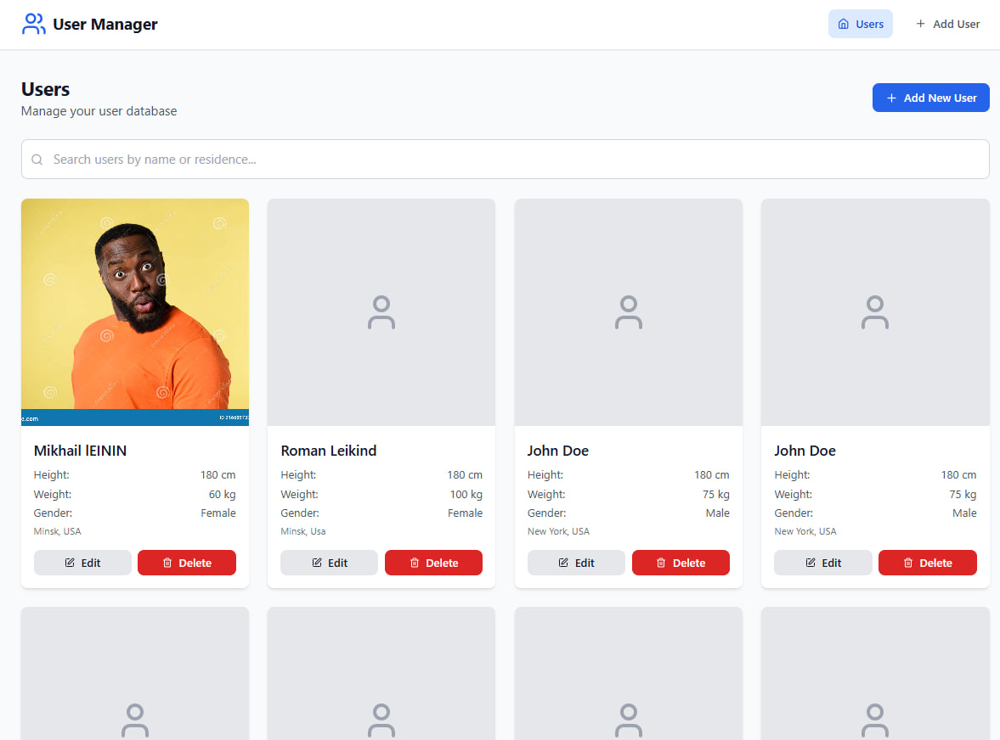
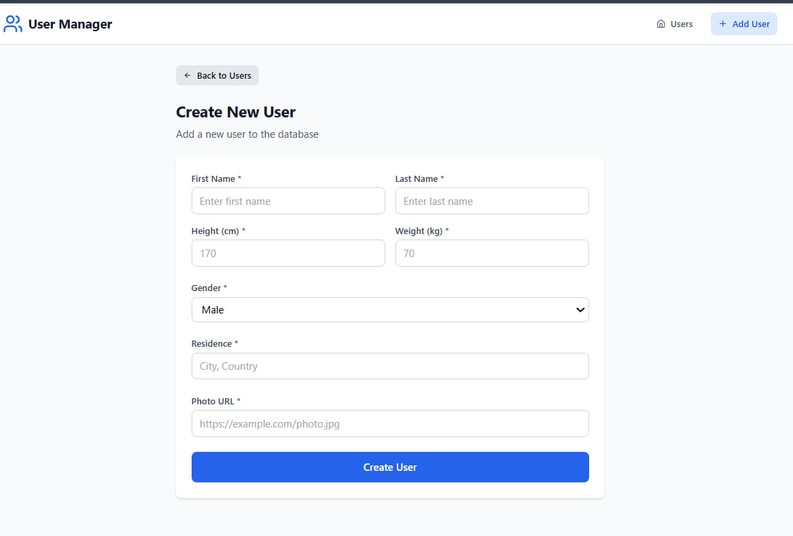
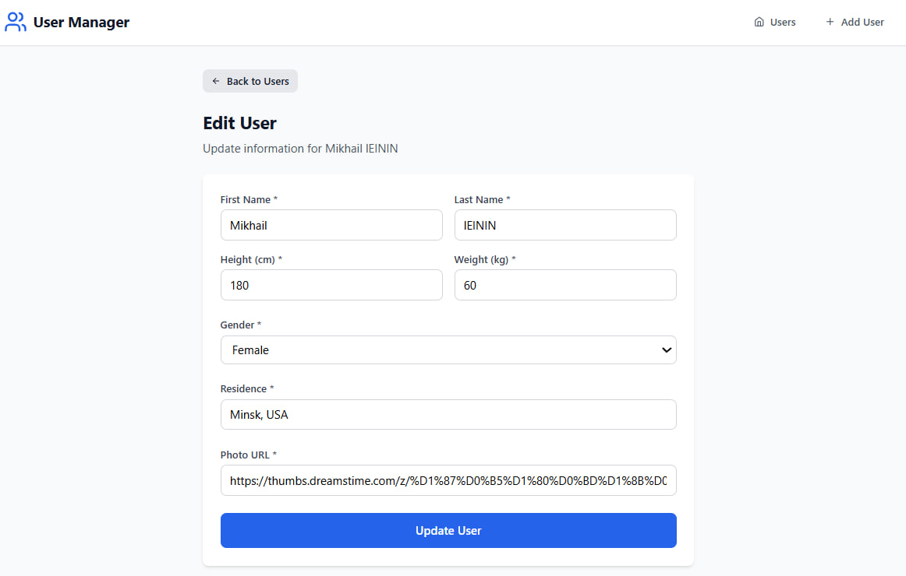
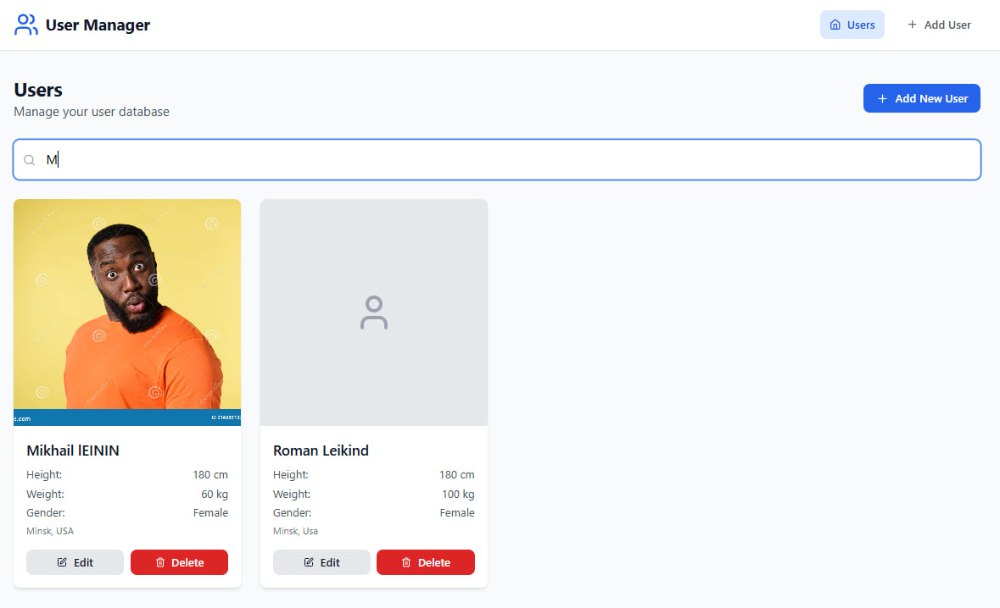
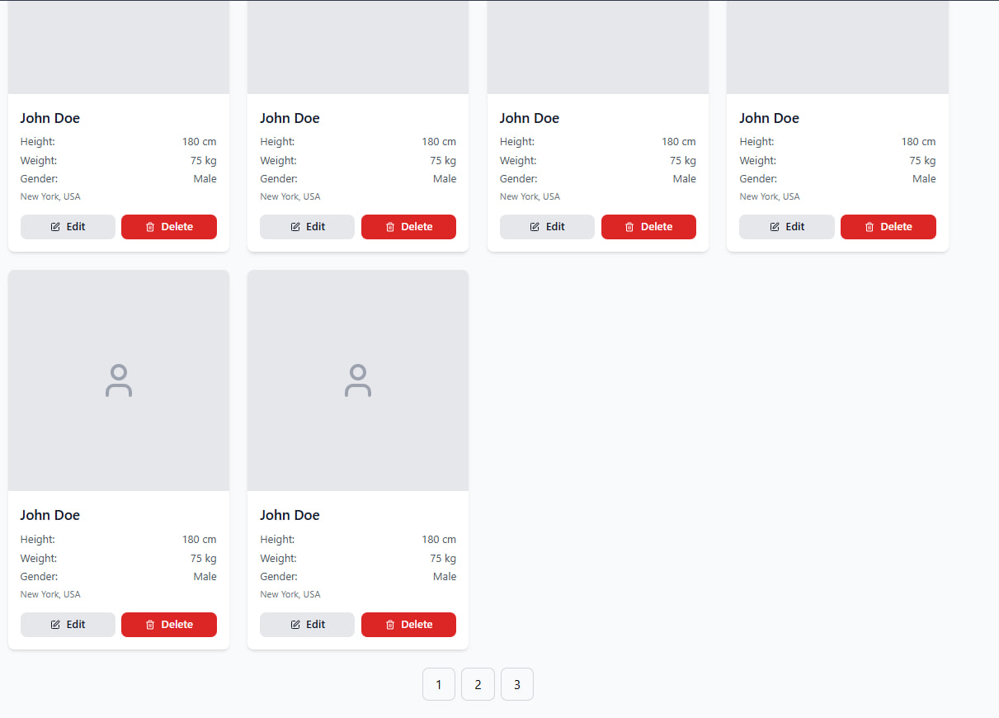
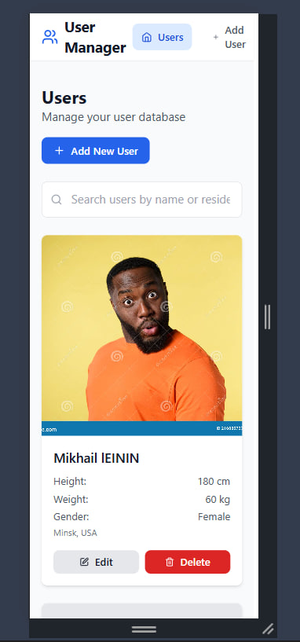
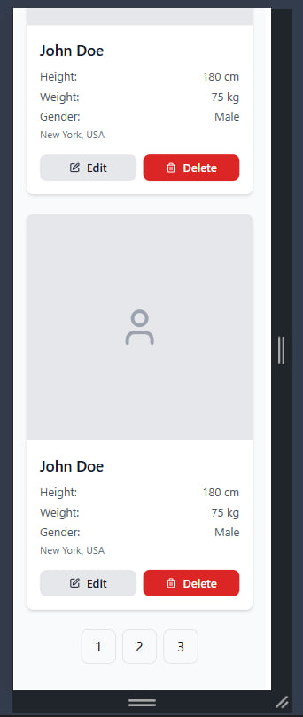

# User Management

Современное, адаптивное одностраничное приложение для управления пользовательскими данными, созданное с использованием React и TypeScript. Включает в себя полный набор CRUD-операций, пагинацию, функции поиска и красивый пользовательский интерфейс.

## 🛠️ Технологии

- **Frontend**: React 18 + TypeScript
- **Routing**: React Router v6
- **Styling**: Tailwind CSS
- **Icons**: Lucide React
- **State Management**: Context API + useReducer
- **Build Tool**: Vite
- **Code Quality**: ESLint + TypeScript


Слушает на хосте `http://localhost:5173`

## Роуты

- `/` — Список пользователей с пагинацией и поиском
- `/create` — Создать новую форму пользователя
- `/edit/:id` — Редактировать существующую форму пользователя


## API Endpoints 

```typescript
GET    /users?page=1&limit=10 
GET    /users/:id              
POST   /users                  
PUT    /users/:id              
DELETE /users/:id              
```

## 📊 Управление состоянием

Приложение использует Context API с useReducer для предсказуемого управления состоянием:

- **UserContext**: управляет пользовательскими данными, загрузкой состояний и ошибками
- **Custom Hooks**: абстрагирует вызовы API и обновления состояния
- **Type Safety**: полное покрытие TypeScript для всех операций с состоянием


## 📱 Адаптивный дизайн

Приложение полностью адаптивно благодаря:
- Мобильному подходу
- Адаптивной сетке макетов
- Сенсорному взаимодействию
- Оптимизировано для всех размеров экранов


## СКРИНЫ












